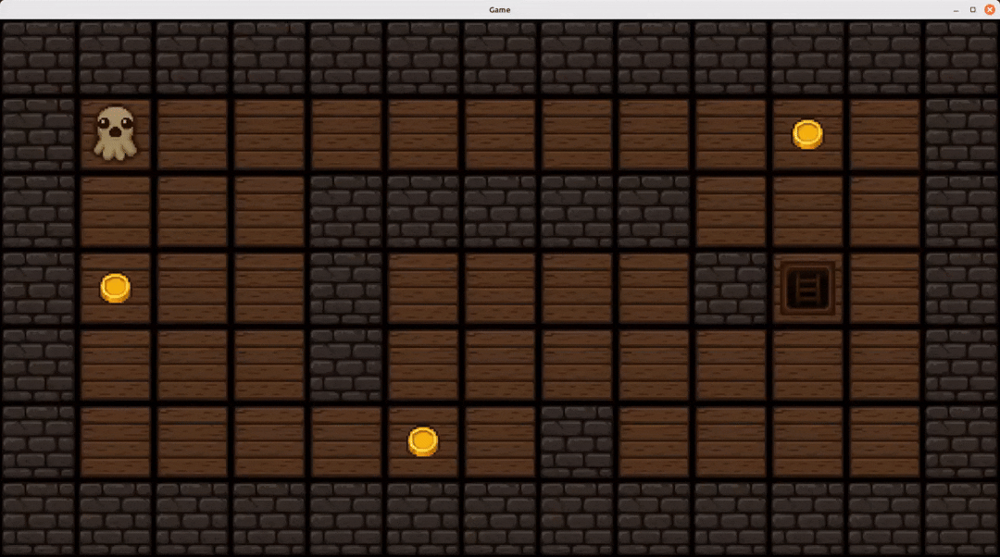

# 2d-engine-c 🕹️

A lightweight 2D game engine logic built from scratch in C, demonstrating map parsing, sprite rendering, input handling, and game loop mechanics.

---

## Features 🚀

- Render 2D graphics with **MLX42** 🖼️
- Uses a custom **libft** 📚 for utility functions
- Handles keyboard input and basic game logic
- Compact and efficient C codebase for small-scale games

---

## How to Play 🎯

Navigate through the map, collect all coins, and reach the exit to win.  
The level can only be completed after collecting all items.



---

## Installation 🔧

Clone the repository:

```bash
git clone git@github.com:Lody-dev/2d-engine-c.git
cd 2d-engine-c
```

Build the project using the provided Makefile:

```bash
make
```

---

## Usage ▶️

Run the executable with a map file:

```bash
./2d-engine-c maps/map1.ber
```

Available maps:

- map1
- map2
- map3

---

## Notes
- Designed as a **lightweight 2D engine logic**, not a full game.  
- Focuses on **low-level programming**, memory safety, and modular architecture.

---

Good luck and have fun!
